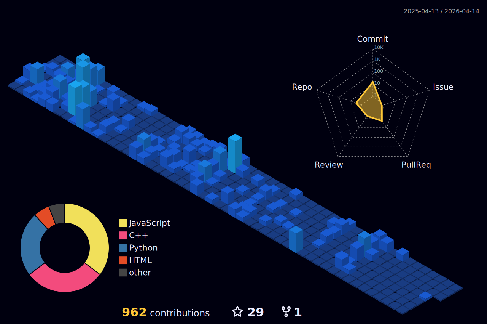

- 👋 Hi, I’m @jideoyelayo1
- 1.5 years experience as a software engineer 
- 🌱 I currently enjoy making projects in C++, React and Python the most but I am a fast learner who is open to use other languages
- 💞️ I’m looking to collaborate on machine learning projects
- 📫 How to reach me at my email JideOyelayo1@Gmail.com

  

### Languages and Tools:

 
 

### :chart_with_upwards_trend: GitHub Stats:

 
 

### 🏆 GitHub Trophies

